# **Quality attributes ENR1**

[Repository link](https://github.com/XMON3R/ArchitekturyENR1)

## **Performance**

Systém potrebuje zvládať nápory študentov počas otvorenia prihlasovania (tisíce až desaťtisíce študentov) \-\> v peaku môže byť pár tisíc requestov za sekundu

**1\) Enrollment Provider \-(posiela v peaku tisíce requestov/s)-\>Enrollment Validator-(spracuje všetky)-\>žiadny request sa nestratí**

- Provider a Validator sú na rôznych deployment nodes \-\> sieťová komunikácia  
- Provider načíta a pošle celú históriu študenta Validatoru \-\> veľký objem dát  
- sieť môže byť preťažená  
- řešením by mohlo být dát je na společný server  
  
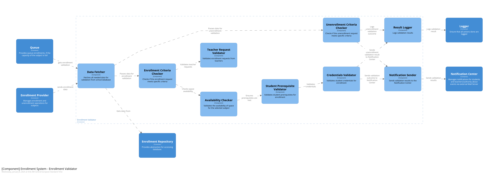
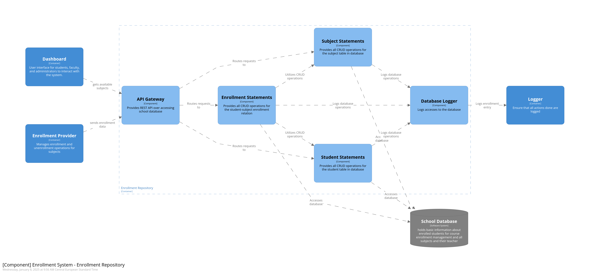
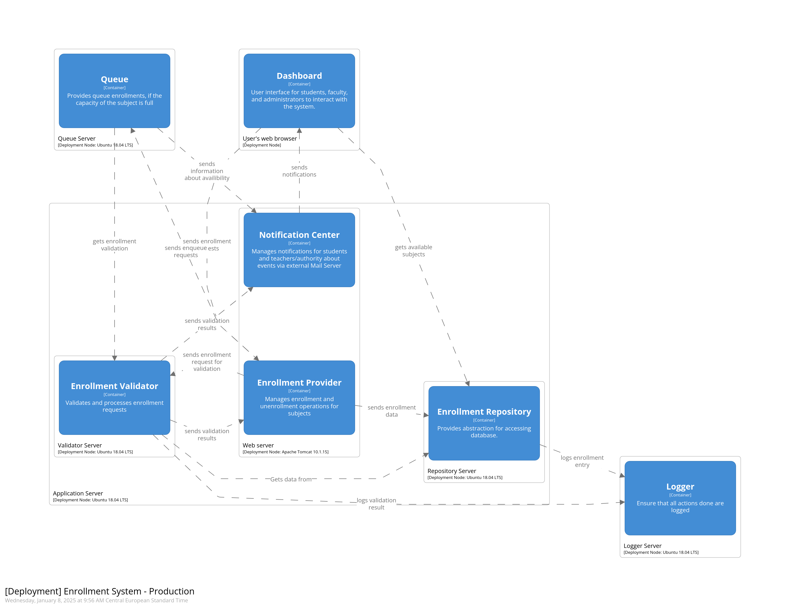

Provider a Validator sú na spoločnom serveri, v requestoch si posielajú iba minimum informácii, ktoré sú potrebné na identifikovanie želanej operácie, zvyšné dáta si Validator vytiahne z databáze sám.

[Structurizr](https://pastebin.com/zZHSRGh8) (Oliver Lago)

**2\) Queue \-(posílá informaci o dostupnosti)-\>Notification Center-(pošle všechny)-\>s průměrným zpožděním mailu 30 sekund**

- Protože posílá notifikace do UI a mailem, nemáme náročný požadavek na zpoždění  
- Je deploynutý na stejném zařízení, jako Enrollment provider a Enrollment repository u kterých hrozí přetížení  
- Může tedy být připravený na informaci o přetížení a poté zpomalí posílání notifikací mailem, aby ušetřil výkon pro naléhavější činnosti ostatních containerů (load balancer)  
- Nebo je možno dát Notification Center na jeho vlastní server, který nebude zatížen jinými požadavky

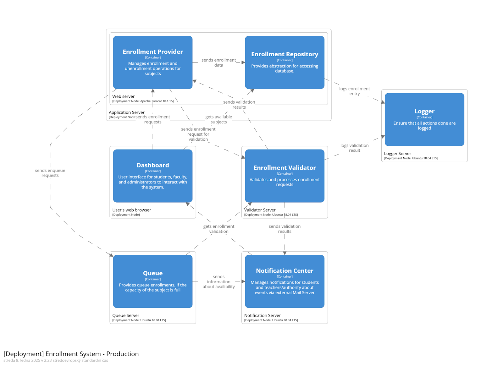  
[Structurizr](https://pastebin.com/c5w5G1v2) (Jiří Kruchina)

**3\) Student přes Dashboard \-(žádá o seznam předmětů)-\>Enrollment Repository-(pošle všechny)-\>s průměrným zpožděním 500 ms**

- Student při zápisu požaduje nižší zpoždění než učitel  
- Mohli bychom přidat Cache pro získávání seznamu předmětů  
- Popř. také rozlišit request od studentů a všech jiných uživatelů

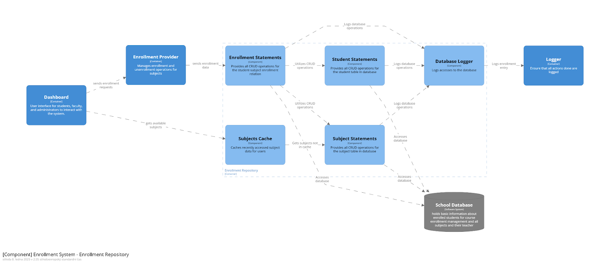
[Structurizr](https://pastebin.com/KUmwSuph) (Jiří Kruchina)

## **Availability**

Dostupnost systému zápisů je důležitá hlavně z pohledu uchování všech již odeslaných dat. Pokud dojde k výpadku systému, tak by neměl trvat déle než pár minut a nemělo by k němu docházet častěji než jednou za den.

**1\) Enrollment Provider \-(nevie čítať alebo zapisovať do Queue)-\> Queue \-(obnovenie Queue, log o obnovení)-\> dáta o stave Queue za posledné 2 minúty nie sú stratené, Queue bude obnovená do 2s**

- aktuálne Queue ukladá všetky dáta do pamäte, žiadna perzistencia, po reštarte sú všetky dáta stratené  
- Enrollment Provider nie je fault tolerant  
- řešením by mohlo být přidat vlastní databázi nebo ukládat také do databáze sdílené

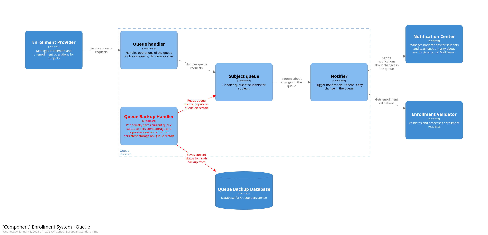 
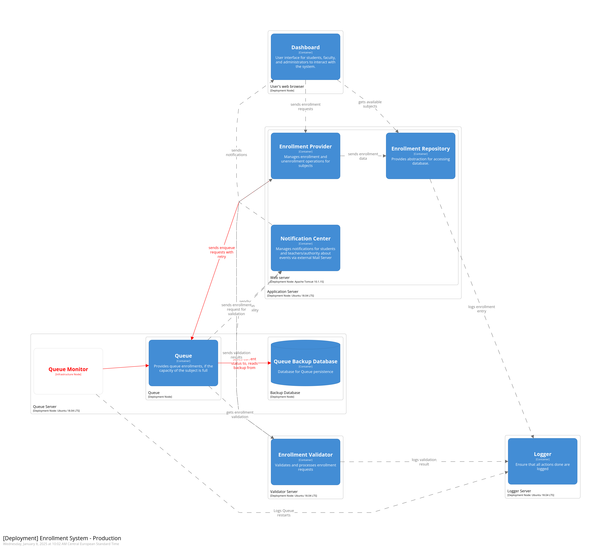

Queue Monitor kontroluje stav Queue. Ak Queue spadne bude monitorom reštartovaná. Queue pravidelne ukladá svoj vnútorný stav do Queue Backup Database. Po reštarte budú z nej všetky dáta načítané.

[Structurizr](https://pastebin.com/5H0nR3h2) (Oliver Lago)

**2\) Enrollment Provider \-(spadne jeho Application server)-\> Enrollment Validator nemá kam výsledky poslat, uloží je ale do Loggeru \-(obnovení dostupnosti Application serveru)-\> Enrollment Provider obnoví odeslané požadavky z Loggeru do 30 sekund**

- Logger bude mít uložené výsledky z Validátoru, tedy je možno jich využít pro rychlejší obnovu systému  
- Logger však nemusí obsahovat všechna data, neboť Enrollment Provider nemusel ještě všechny požadavky Validátoru poslat \- požadavky na zápis budou ztraceny  
- Řešením by mohlo být logovat i rovnou po přijetí požadavku z Enrollment Provideru  
- Přidáme tedy Request Logger do Enrollment Provideru, který bude logovat každý požadavek a také bude umět po restartu serveru znovu načíst nedokončené požadavky

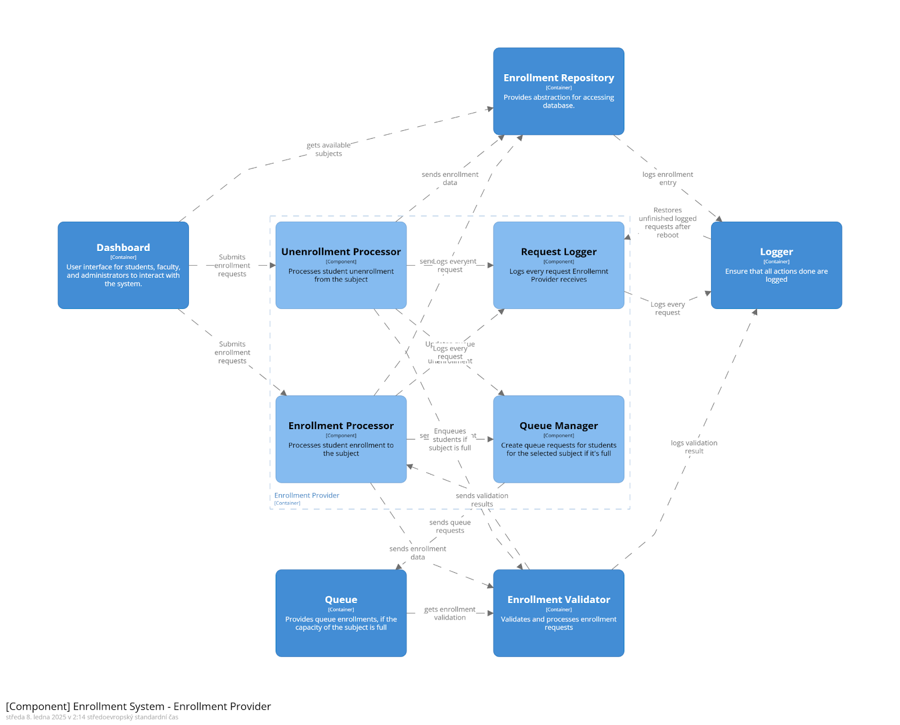
[Structurizr](https://pastebin.com/Ju9uCWsv) (Jiří Kruchina)

**3\) Queue-(chyba siete/serveru na ktorom bezi Validator)-\>Enrollment Validator nezvaliduje \-(obnovení dostupnosti Validator serveru)-\> Queue do obnovení provozu Validátoru by si měla ukládat čekající požadavky pro validaci a pošle do 10 sekund znovu**

- Queue a Validator bežia na rozdielnych serveroch, preto používajú sieť na komunikáciu  
- Implementovať retry mechanizmus, aby sa zabezpečila validácia všetkých enrollment requestov v Queue  

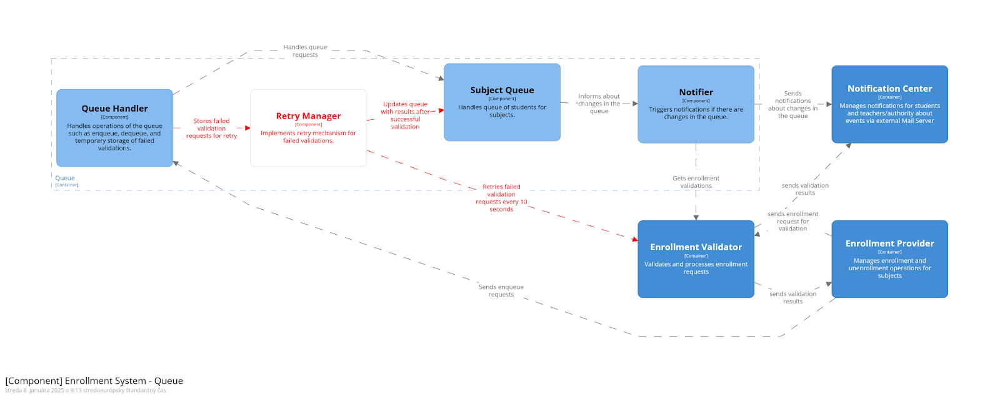
[Structurizr](https://pastebin.com/BMaZxE5y) (Erika Kunová)

## **Scalability**

Zápis na předměty se otevírá pro všechny najednou. V tuto chvíli bude třeba systém škálovat pro větší zátěž; zbytek zápisu pak zase může mít méně zdrojů.

**1\) Enrollment Provider \-(posílá při zátěži mnoho požadavků na validaci zápisu)-\>Enrollment Validator \-(navýšen počet validator serverů)-\> dostupnost ani výkon nebude ovlivněna**

- Enrollment Validator je velice dobře škálovatelný, neboť je umístěn na svém vlastním Validator Serveru.  
- Enrollment Validator je dobře odizolován a všechna jeho práce až na počateční vstup a výstup se děje nezávisle na všem ostatním a tak nemusí řešit synchronizaci s jinými servery během běhu a tak není něma omezen.  
- Enrollment Provider si může vybírałt, na který Validátor data pošle. Může tedy využít load balancer pro uměrné rozdělení zátěže.

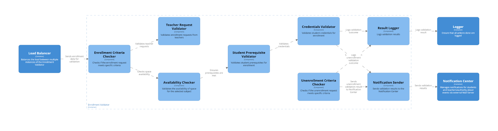
(Štefan Funka \+ Filip Bubák)

## **Security**

Systém potrebuje uchrániť citlivé údaje študentov pred zneužitím/nepovolaným čítaním. Komunikácia s externým serverom musí byť bezpečná, kvôli prevencii zneužitia.

**1\) Enrollment Repository \-(posiela/prijíma citlivé data)-\> útočník přečte / změní data po cestě do/z School Database \-(změna detekována)-\> zabránění útoku**

- Validácia a sanitizácia dát   
- Kódovaná komunikácia s databázou

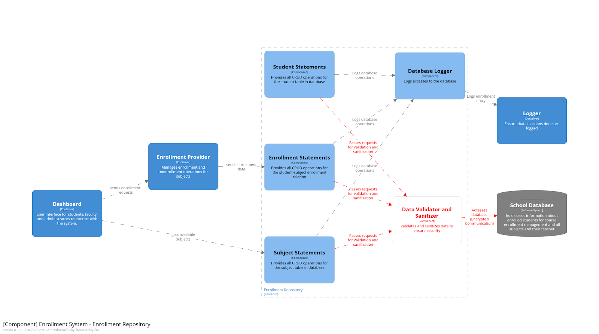
[Structurizr](https://pastebin.com/BMaZxE5y) (Erika Kunová)

**2\) Útočník \-(pošle nevalidní požadavky pro zápis)-\> Enrollment Provider \+ Validator \-(odmítnutí požadavků)-\> Data zapsaných studentů na předměty zůstanou nezměněna**

- Do Enrollment Validatoru je možno ještě přidat User Authorization Validator, který ověří práva uživatele na akci, kterou Enrollment Validator zpracovává

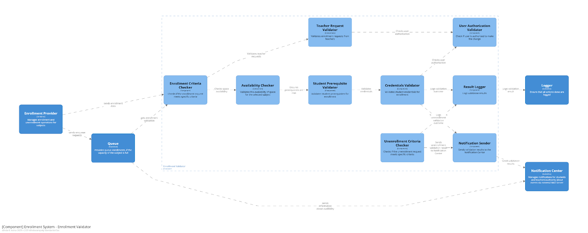
[Structurizr](https://pastebin.com/K69FKAwh) (Jiří Kruchina)

## **Modifiability**

**1\) Dashboard \-(nový typ předmětu pro zápis)-\> Design Time \-(zápis nového typu předmětu je implementován)-\> 4 týdny práce (včetně testování)**

- Současná implementace je dobře připravena na přidání dalšího typu  
- Zmodifikovat by se musely Processory uvnitř Enrollment Provideru (+ Validator)

(Jiří Kruchina)

## **Testability**

**1\) System Tester \-(otestování validace zápisů)-\> Testing environment with Tester Script \-(otestování veškeré funkcionality pro zápis)-\> Zdetekovány všechny možné problémy při zápisu**

- Přidáním Tester Scriptu a Mock implementace Enrollment Repository je možné otestovat celou flow zápisu na předmět bez nutnosti mít funkční připojení k databázi

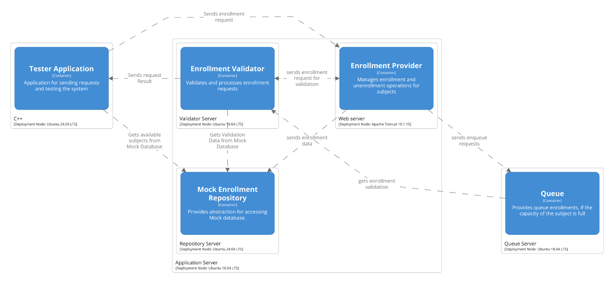 
(Filip Bubák \+ Štefan Funka) [Structurizr](https://pastebin.com/z7jJdaJY)

## **Interoperability**

**1\) Externí Enrollment Provider \-(posílá zápisy na zvalidování pomocí API)-\> náš Enrollment Validator \-(poskytne výsledek validace)-\> Enrollment Provider obdrží správné výsledky validace (100%)**

- Náš Enrollment Validator zapisuje všechny validace do Loggeru \-\> mohl by pak obsahovat i data z externího požadavku  
- Řešením by mohlo být přidat část validátoru, která vybere správný Logger \- pomocí API by externí Enrollment Provider specifikoval Logger, který se má použít

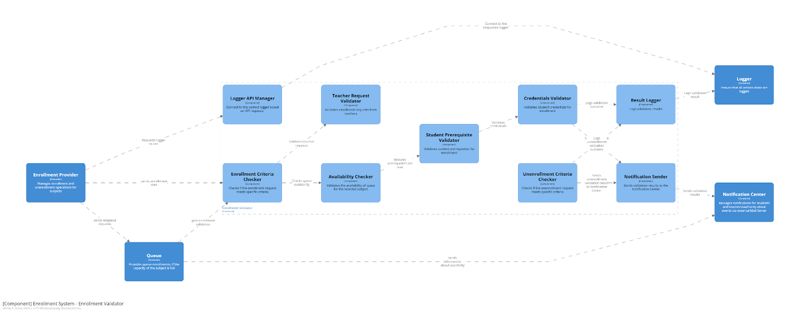 
[Structurizr](https://pastebin.com/s7nkaxWW) (Jiří Kruchina)
